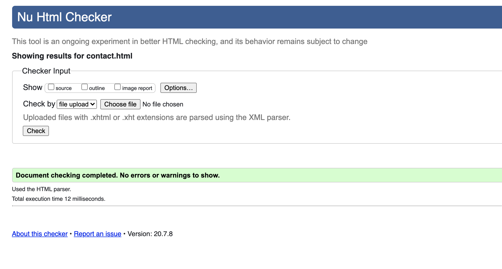
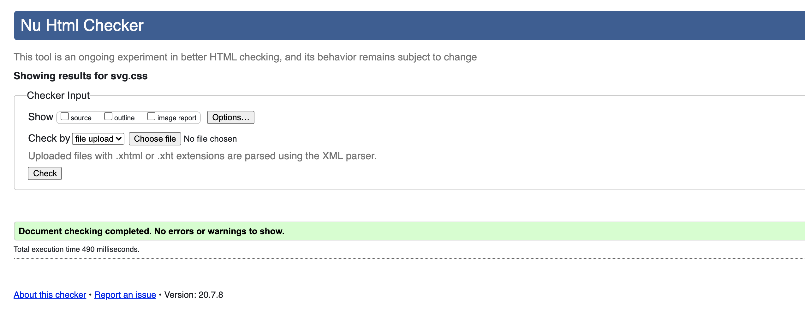
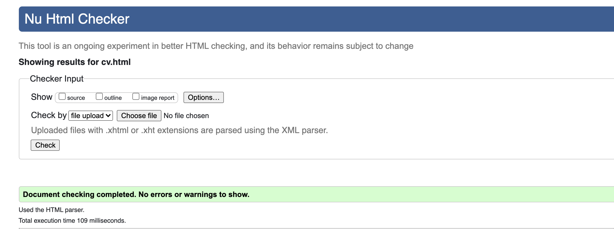
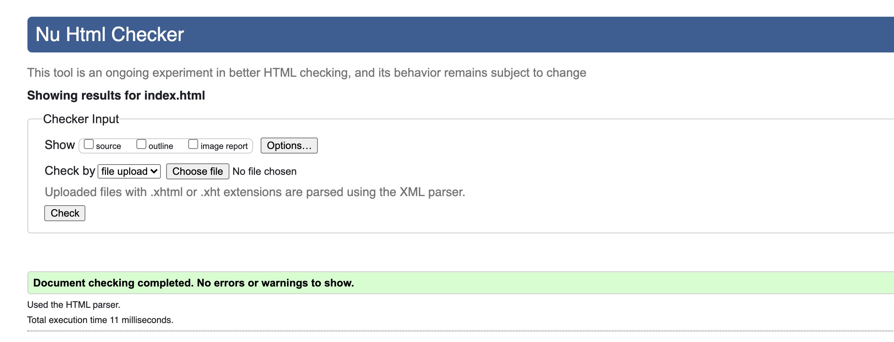
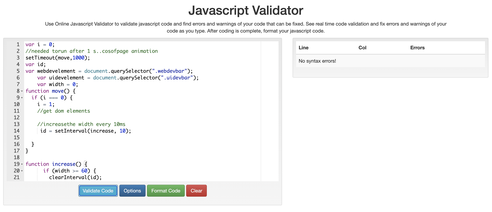
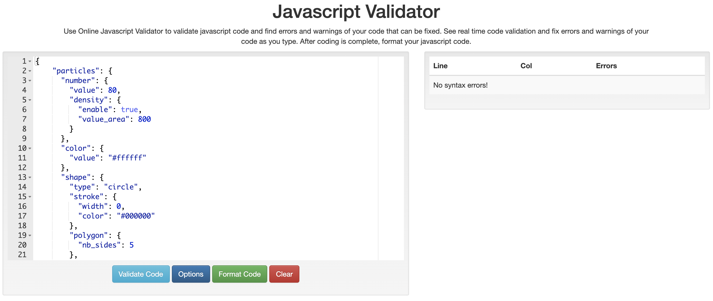
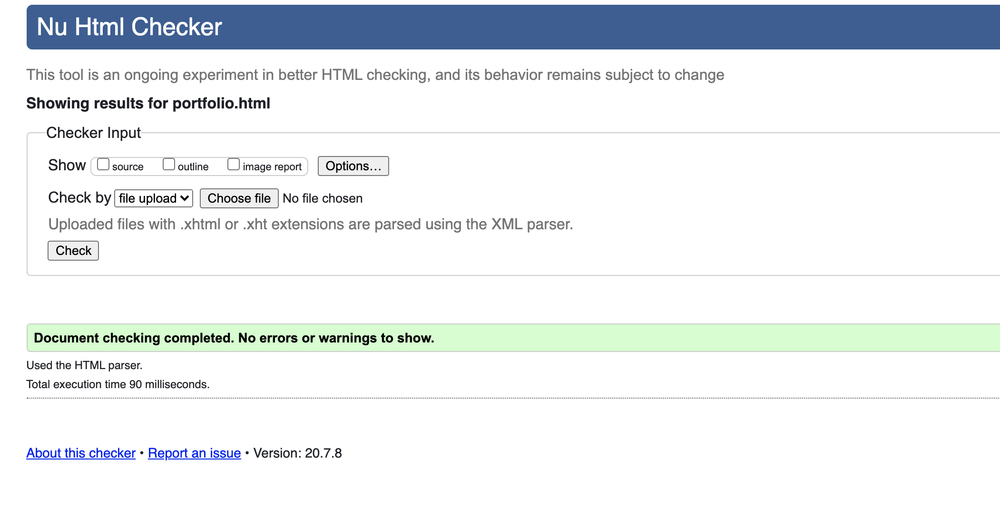
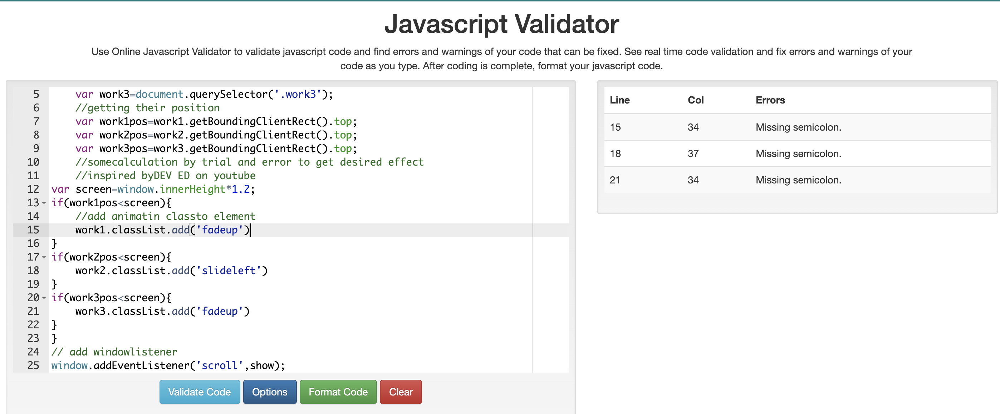
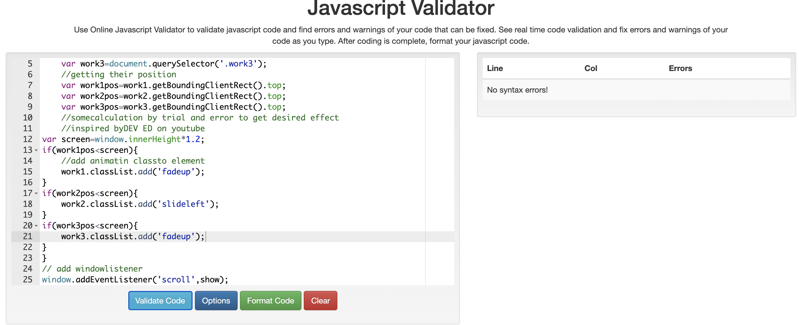
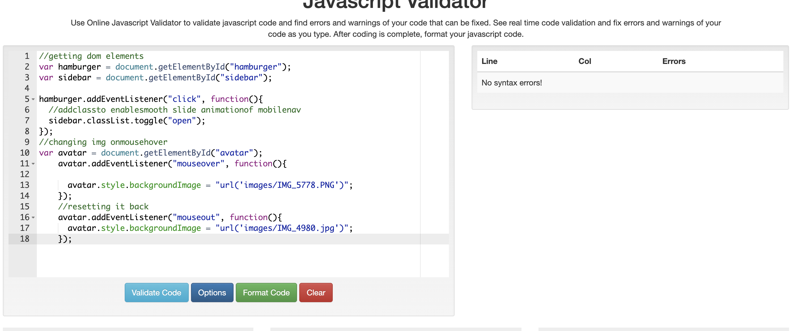

# portfolio
contact page:

css page:

cv page:

index page:

          
 loadbars(JS):

          
particles(JS) :

          
 portfolio :

          
 scrollanim(JS):

  fixed by adding the missing semicolon 

slide(JS)

